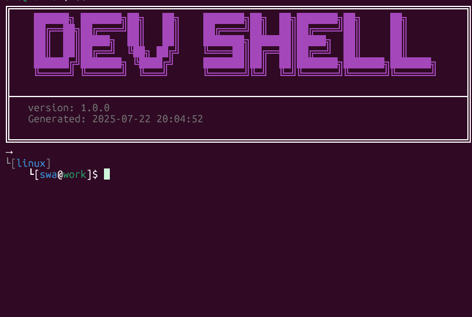
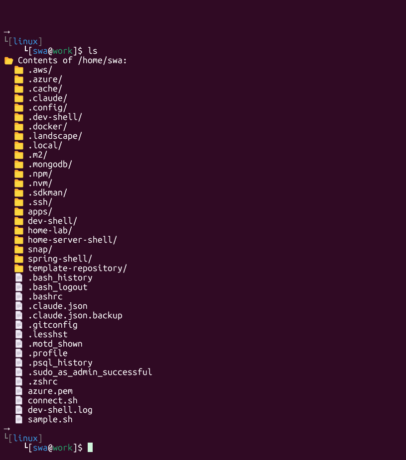
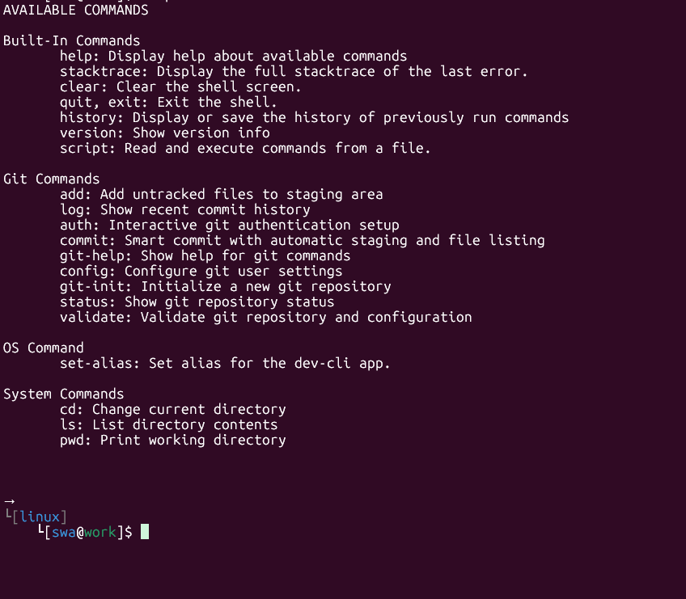

# DEV-SHELL
### ABOUT
The purpose of this project is to create a CLI application that will help me  with my repetitive tasks along the way.

this project is 100% human-made. I am so sick with fucking AI and their bullshit that i will refuse to use any code generated by them.

### SCOPE AND LIMITATIONS
- CLI APP ONLY!
- NO-SSH CONNECTION YET
- NO NEED TO CREATE A SERVER
- NO GUI!!!!
- NO COMMAND SHALL BE USED FOR APP SPECIFIC STUFF. IT MUST BE AS GENERIC.

### RULES
- ABSOLUTELY NO  PREMATURE Optimization!!!!
- NO FEATURE CREEP
- NO OVER-ENGINEERING!!!!
- TEST EVERYTHING. EVERY METHOD. EVERY CREATION. EVERYTHING
- ONLY CREATE WHEN A CLASS WHEN ABSOLUTELY NECESSARY
- ONLY START CODING WHEN THE DOCS IS DONE

### SCREENSHOTS

#### Application Startup

#### LS Command Demo

#### Help Demo

